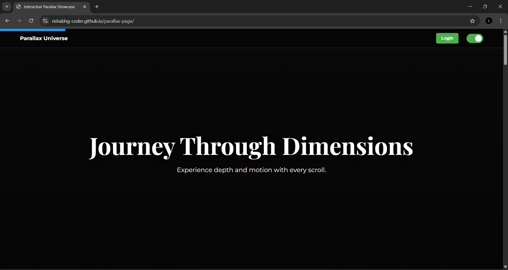

# 🚀 Dynamic Frontend Dashboard

A fully responsive, interactive frontend dashboard featuring **dynamic parallax scrolling**, **persistent light/dark mode**, and a **real-time validated login modal**.



---

## ✨ Features
- ✨ **Smooth & Accessible Parallax** — High-performance animations using `requestAnimationFrame` with `prefers-reduced-motion` support.
- 🌗 **Light/Dark Theme Toggle** — Saves user preference using local storage.
- 🪐 **NASA REST API Integration** — Fetches and displays live "Picture of the Day" data asynchronously.
- 📊 **Interactive Data Visualization** — Built using **Chart.js** for a modern analytics experience.
- ⚙️ **Validated Login Modal** — Real-time feedback with password visibility toggle for better UX.
- 📶 **Connectivity Monitor** — Displays online/offline status and estimated network speed.
- 📱 **Responsive Design** — Optimized for all screen sizes.

---

## 🧰 Tech Stack
- **Frontend:** HTML5, CSS3, JavaScript (ES6+)
- **Libraries & APIs:** Chart.js, NASA REST API

---

## 🔧 Setup Instructions

1. Clone the repository:
   ```bash
   git clone https://github.com/RishabhG-coder/parallax-page.git
2. Navigate to the project folder:
   ```bash
   cd parallax-page
3. Open index.html directly in your web browser.
4. (Optional) Add your own NASA API key in script.js for personalized data access (requires regenerating the key if already shared).

### 🌌 Demo  
🔗 [Live Preview](https://rishabhg-coder.github.io/parallax-page/)
